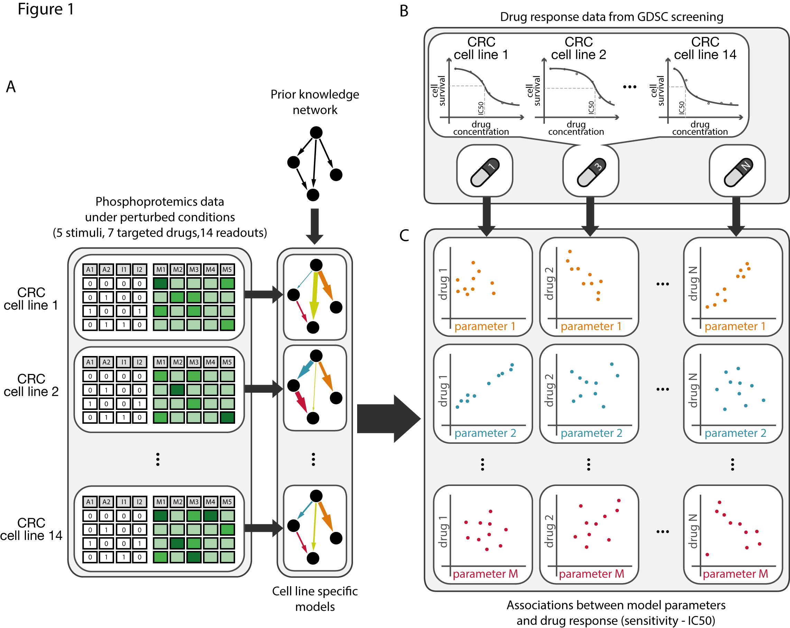
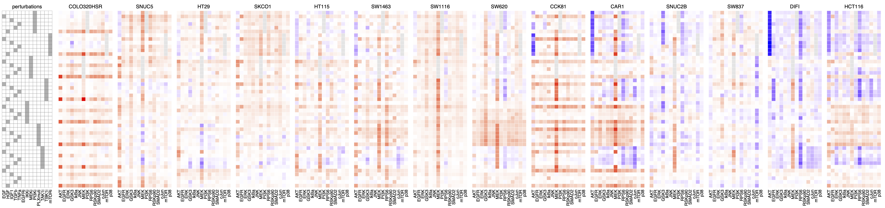
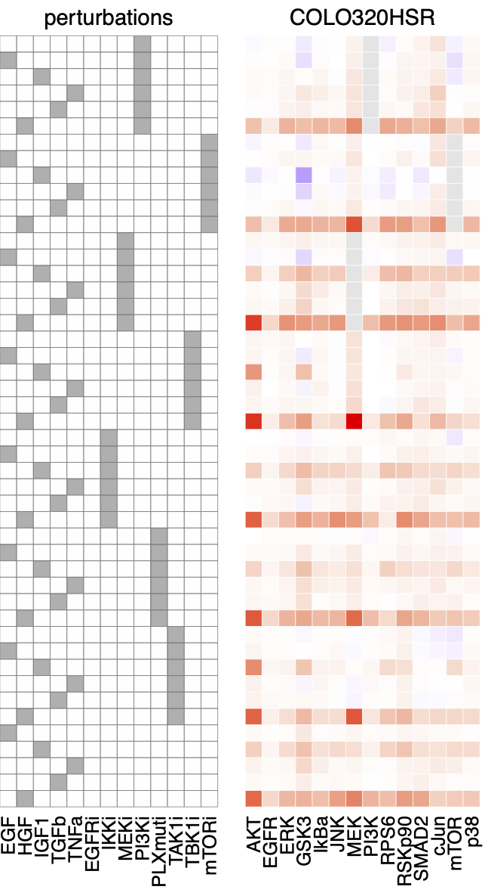
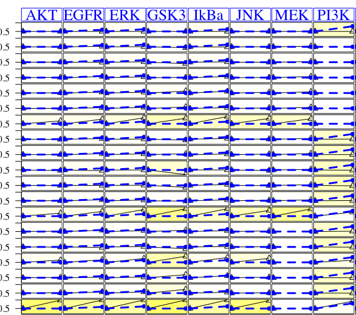
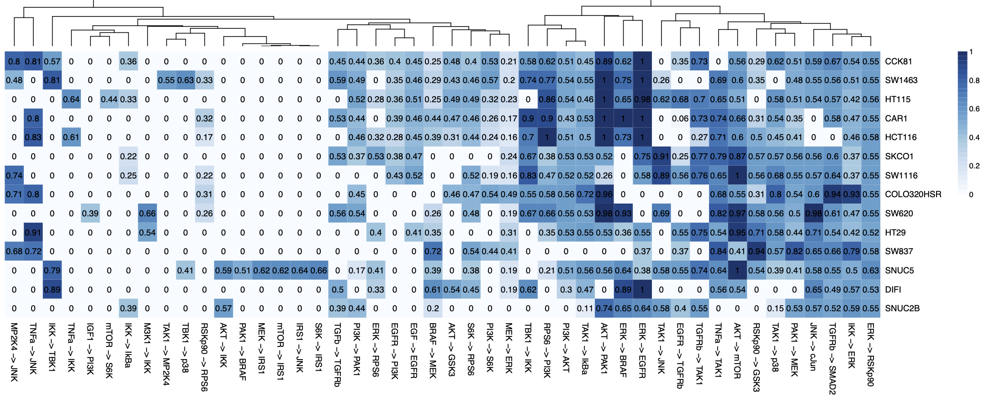
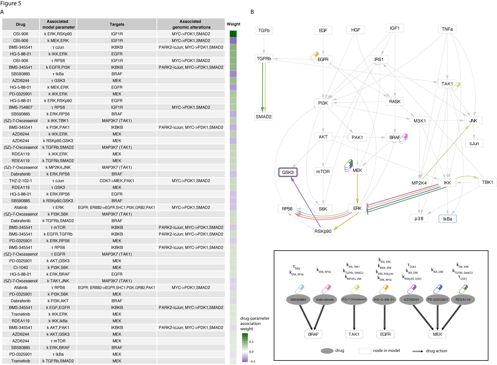

```{r setup, include=FALSE}
knitr::opts_chunk$set(echo = TRUE)
```

# Introduction

The goal of this tutorial is to introduce the CellNOpt framework ([Terfve et al.
2012](https://bmcsystbiol.biomedcentral.com/articles/10.1186/1752-0509-6-133))
and give some basics in network motifs.

## CellNOptR

CellNOptR is a R implementation of the CellNOpt framework and can be used to

-   create logic-based models of signaling networks using different formalisms
    (Boolean, Fuzzy, or differential equations)
-   combine prior knowledge and perturbation experiments
-   build an executable model that can be executed (simulated) and used to make
    predictions for testable hypotheses.

These specific, contextualised models can be used, for example, to understand
the different signaling patterns among cell-lines or patients or to predict drug
response.

CNORode is a member of the CellNOptR logic based tool family. It can translate
the network to ordinary differential equation (ODE) model, fit the model
parameters to data and make predictions.

## Setup

```{r message=FALSE, warning=FALSE}
library(CellNOptR)
library(CNORode)
library(MEIGOR)
library(tidyverse)

```

# PART I

The goals of part I are

-   get familiar with network file formats accepted as inputs to CellNOpt and
    other network modeling tools

-   check small network motifs to

    -   get use to the visualisation schemes
    -   understand the dynamic logic models

## Input Data

CellNOpt uses a prior knowledge network stated as an interaction file to build a
Boolean logic model.

**TASK 1**: check the format of the SIF file, in `data/tutorial_1_network.sif`:
You can open it in RStudio or running:

```{r}
writeLines(readLines("./data/tutorial_1_network.sif"))
```

SIF ([simple interaction
format](http://manual.cytoscape.org/en/stable/Supported_Network_File_Formats.html#sif-format))
is a file format that is simple to interpret and can be understood by other open
source platforms for network modeling and visualization such as
[Cytoscape](https://cytoscape.org/).

We find 2 lines that describes 2 interactions between nodes a, b and c. Both
node a and node b can activate node c.

Large networks are complicated to check, therefore we can plot the network as a
graph.

**TASK 2** Visualise the SIF file in CellNOptR:

```{r, fig.height=3, fig.width=3}
model <- readSIF("./data/tutorial_1_network.sif")
plotModel(model)
```

The graph shows the 2 interactions as expected.

The network is already converted to a network object:

```{r}
print(model)
```

-   *reacID* enumerates the edges of the network.
-   *nameSpecies*: contains the nodes
-   *interMat*: is an interaction matrix between nodes and edges
-   *notMat*: shows inhibitor edges (none in this model)

**TASK 3**: check the format of the MIDAS ([*Minimum Information for
DataAnalysis in Systems
Biology*](https://www.ncbi.nlm.nih.gov/pmc/articles/PMC2617752/) ) file, in
`data/tutorial_1_data.csv` (best in Excel):

```{r}
writeLines(readLines("./data/tutorial_1_data.csv"))
```

Each row of the MIDAS file encodes a measurement. Column notations:

-   *TR*: treatment
-   *DA*: time of data acquisition
-   *DV*: measured value of the node

**TASK 4**: Create a CNOlist object from the MIDAS data file and annotate the
network

```{r fig.height=3, fig.width=3}
cnodata <- CNOlist("./data/tutorial_1_data.csv")
plotModel(model = model, CNOlist = cnodata)
```

Inputs (a and b) are highlighted with green, measured nodes are with blue.

**TASK 5**: Print and visualise the data object

```{r}
print(cnodata)
```

```{r fig.height=4, fig.width=4}
plot(cnodata)
```

The figure shows an experiment in each line.\
Perturbations/Cues (a and b) are 1 (on) or 0 (off). Node C is activated only in
the last condition, where both A and B are activated.

## Model building

**TASK 6**: Simulate the model and compare it to the experimental data:

```{r,fig.height=4, fig.width=4}
edges <- c(
  "a=c" = 1,
  "b=c" = 1
)

sim_res <- cutAndPlot(cnodata, model, list(edges))
```

The model predicts an increase of node C if any of A or B increased, i.e. both A
and B can activate C.

Hint: The model assumes **OR** interaction

How do we fix it?

```{r, fig.height=3, fig.width=3}
prep_model <- preprocessing(
  data = cnodata,
  model = model,
  cutNONC = TRUE, # cut non-controllable subnetwork
  compression = TRUE, # compress if possible
  expansion = TRUE, # expand OR gates
  verbose = TRUE
)
plotModel(prep_model, cnodata)
```

The preprocessing steps included an **AND** gate between the inputs:

```{r}
print(prep_model$reacID)
```

Let's fix the model to match the measured data:

```{r, fig.height=4, fig.width=4}
# we turn off the a=c and b=c edges:
edges <- c(
  "a=c" = 0,
  "b=c" = 0,
  "a+b=c" = 1
)

sim_res_and <- cutAndPlot(cnodata, prep_model, list(edges))
```

The model with a single AND gate between the 2 edges is now in agreement with
the data.

Boolean algebra: What other Boolean operations are you familiar with? Which ones
do you think can be used to represent interactions in biological signaling
networks?

# PART II: Small, but realistic boolean model

The goals of PART II is to

-   check a small but more realistic model
-   optimise the model to data
-   do predictions to other condition --\> experimental design.

## Input data

**Task** : import the data and network file, visualise them separately.

```{r}
dataToy <- CNOlist("data/tutorial_2_data.csv")
networkToy <- readSIF("data/tutorial_2_network.sif")
```

The preprocessed experimental data:

```{r}
plot(dataToy)
```

This is a complex dataset, where the cells were treated with EGF and TNFa
stimuli in combination with RAF and PI3K inhibitors.

Can we answer questions, like: 1. what ligand activates AKT? 2. Is Hsp27
responding to EGF stimulation?

Now visualise the prior knowledge network: (it is very handy that we have one
and we dont have to read dozens of papers...)

This prior knowledge network contains all the edges among these nodes that we
think is relevant to the problem.

```{r}
plotModel(networkToy, CNOlist = dataToy)
```

There are red and white nodes:

-   red box indicates nodes that are inhibited in certain conditions,
-   white boxes are nodes that are not measured

Red T-shape arrows indicate inhibitory interactions.

Is this prior knowledge network in agreement with the above data?\
According to the prior knowledge, should Hsp27 respond to EGF?

## Simulate the model

Let's simulate the prior knowledge and compare it with the data:

```{r}
sim_PKN <- cutAndPlot(
  CNOlist = dataToy,
  model = networkToy,
  bStrings = list(rep(1, length(networkToy$reacID)))
)
```

Apparently the prior knowledge is not in agreement with the data. This happens,
because prior knowledge is not specific to the measured cell-line. It assessed
by us and we included many interactions that we belived is needed.

## Network model optimisation

To find a *subset* of edges that makes the model to fit the data we use
optimisation.

```{r}
prep_network_Toy <- preprocessing(dataToy, networkToy,
  expansion = TRUE,
  compression = TRUE,
  cutNONC = TRUE,
  verbose = TRUE
)

plotModel(prep_network_Toy, dataToy)
```

Note the AND gates and missing white boxes. They disappeared beacause of
compression.

We use genetic algorithm to find an optimal set of edges.

```{r}
ToyT1opt <- gaBinaryT1(
  CNOlist = dataToy,
  model = prep_network_Toy,
  verbose = FALSE
)
```

Plot the optimised network's prediction:

```{r}
sim_opt_PKN <- cutAndPlot(
  CNOlist = dataToy,
  model = prep_network_Toy,
  bStrings = list(ToyT1opt$bString)
)
```

show the optimised network:

```{r}
plotModel(prep_network_Toy, dataToy, 
          bString = ToyT1opt$bString, removeEmptyAnds = F)
```

Here the edge color encodes if the edge is still included in the optimised
subnetwork. Black edge means that the edge is still active in the model, and
grey links are removed by the optimiser.

What did we optimize? How do we know how good a solution network is? How do we represent the problem? How does a genetic algorithm work? Can we use something else to solve the same problem?


# PART III: Real-world data

The folowing is based on the
[paper](https://cancerres.aacrjournals.org/content/77/12/3364.full)

> Eduati et al (2017) Drug resistance mechanisms in colorectal cancer dissected
> with cell type-specific dynamic logic models. *Cancer Research*. DOI:
> 10.1158/0008-5472.CAN-17-0078

On Github: <https://github.com/saezlab/CRC-pathway-biomarkers>

We investigate here the drug-response of colorectal cancer cell lines. For this,
we use drug response data and a signaling dataset.

```{r echo=FALSE, out.width='100%'}

```

The Genomics of Drug Sensitivity in Cancer (GDSC),
<https://www.cancerrxgene.org/> offers drug response data for more than a 1000
human cancer cell lines, for hundreds of drugs. A small part of these data is
can be found in `"./data/IC50_GDSC.csv".`

The perturbation dataset contains the short time signaling response of 14
colorectal cancer cell lines, where 14 phosphoproteins are measured under 43
perturbation conditions (5 stimuli, 7 inhibitors).

First, we construct signaling models based on the perturbation data to the cell
lines, here we use the CNORode modelling package. In the next step, we will
associate model features to drug response to see why certain cell lines respond
to certain drugs and others do not. Here we use a linear modeling framework.


## DRUG response exploration

Let's explore the GDSC data

```{r message=FALSE}
IC50 <- read_csv("./data/tutorial_3/IC50_GDSC.csv") %>%
  rename("cell_line" = "...1")
print(IC50)
```

```{r message=FALSE}
IC50 %>%
  pivot_longer(names_to = "drug_name", values_to = "log_IC50", -cell_line) %>%
  ggplot() +
  geom_point(aes(drug_name, log_IC50, col = cell_line)) +
  coord_flip() +
  theme_bw() +
  ggtitle("Drug response of 14 CRC cell lines")
```

Form the raw IC50 values we can see that there are some drugs that are more
effective (Trametinib) than others, like XMD14-99. There are also cell-line
differences, for example, DIFI shows stronger sensitivity to Afatinib than any
other cell lines. What could be the reason for this?

## From logic to continous models

The goal of part III is to build a cell-line specific model from the perturbation
data using CNORode.

This model is an ordinary differential equation (ODE) model, where the equation
for each state ($x_A$) can be written as
$$\frac{dx_A}{dt} = \tau_A(B(f_1(x),f_2(x),...)-x_A) $$ here

-   $f_i(x)$ represents the incoming edges on node $A$ with a transfer function.
    This transfer function typically has an S-shape.
    $$ f(x) = \frac{x^n}{x^n+k^n}$$

    ```{r echo=FALSE}
x <- seq(0, 30, by = 0.1)
n <- seq(2)
k <- runif(2, 0, 10)

expand_grid(x, k, n) %>%
  mutate(f = x^n / (x^n + k^n)) %>%
  mutate_at(c("k", "n"), as.factor) %>%
  ggplot(aes(x = x, y = f)) +
  geom_line(aes(color = k, linetype = n)) +
  theme_classic()
    ```

-   $B$ is a Boolean homologue function. This is responsible to combine the
    incoming edges with the OR and AND gates. For example, an OR gate is
    represented by $x_1\cdot x_2$.

-   $\tau$ is a time parameter, that tells how fast node A adapts to the input.

-   the model has free parameters: a $\tau$ for each node, and ($k$,$n$) for
    each edge. These are found by optimisation.

The main differences are that in ODE models the states are continuous values,
therefore it is quantitative, not only qualitative like a Boolean model.
Further, here we haVe to find the specific edge and node parameters.

What do we need to build and simulate a differential equation model?

-   the equations are derived from the network graph
-   inputs: given in the MIDAS description
-   Initial conditions for each state in each experiment

In this example, the baseline is set to 0.5. A value of 1 means full activation
and 0 means full inhibition of the node.

## Perturbation data

The following heatmap shows an overview on the perturbation data. The first
block outlines the combinations of treatment. Then each other block represents
the response of a cell line. Different columns within a block shows the
different phosphoprotein markers.

```{r, echo=FALSE, out.width='100%'}

```

In the tutorial we make a single model for the first cell line *COLO320HSR*.

```{r, echo=FALSE, out.width='30%'}

```

## Model a single cell line

Similarly to the previous tutorial with CellNopt, here we also start by
importing a prior knowledge network and the perturbation data in MIDAS format.

```{r}
# load Prior Knowledge Network (PKN)
pknmodel <- readSIF("./data/tutorial_3/PKN.sif")

# load normalised perturbation data
# select MIDAS file for the desired cell line
MIDASfile <- "./data/tutorial_3/processed/MIDAS/MD-COLO320HSR_Ktuned_v1_n4_all_noEGFRi_CNORode.csv"

Mydata <- readMIDAS(MIDASfile = MIDASfile, verbose = FALSE)
cnolist <- makeCNOlist(Mydata, subfield = FALSE)
cnolist$valueStimuli[cnolist$valueStimuli == 0] <- 0.5
```

Show the network first

```{r}
plotModel(pknmodel, cnolist)
```

As in CellNOPt:

-   green nodes are stimulated in some experiments
-   blue nodes are measured
-   white nodes are modelled, but not measured
-   red nodes or red bordered nodes are occasionally inhibited
-   black edges represents activation, red T-shaped arrows represents inhibition

Then the data in CellNOpt format:

```{r}
plotCNOlist(cnolist)
```

The data is very large, therefore is hard to see the details, but we can notice
as some nodes increases their activity at the final time (30 mins).

```{r}
# compress the network (no expansion, only OR gates are considered)
model <- preprocessing(
  data = cnolist, model = pknmodel,
  compression = TRUE, expansion = FALSE
)

# set initial parameters
# (here parameters 'k' and 'tau' are optimised and 'n' fixed to 3)
ode_parameters <- createLBodeContPars(model,
  LB_n = 1, LB_k = 0, LB_tau = 0,
  UB_n = 3, UB_k = 1, UB_tau = 1,
  default_n = 3,
  default_k = 0.5,
  default_tau = 0.01,
  opt_n = FALSE, opt_k = TRUE, opt_tau = TRUE,
  random = TRUE
)

# PLX -> BRAF is an artificial regulation used to model paradoxical effect of
# PLX4720, which works as selective BRAF inhibitor in cell-lines where BRAF is
# mutated in V600E (i.e. HT29 and SNUC5 in our panel), but induces a paradoxical
# activation of wild type BRAF cells (modeled as stimulus on those cell lines)
ode_parameters$parValues[which(ode_parameters$parNames == "PLX_k_BRAF")] <- 0.5
ode_parameters$index_opt_pars <- setdiff(
  ode_parameters$index_opt_pars,
  which(ode_parameters$parNames == "PLX_k_BRAF")
)

## Parameter Optimization
# essm
paramsSSm <- defaultParametersSSm()
paramsSSm$local_solver <- "DHC"
paramsSSm$maxtime <- 30
# 36000;
paramsSSm$transfer_function <- 4
```

The actual optimisation takes around 10 mins, instead of the 30 sec. So, instead
of running it here, we just load the results:

```{r, eval=FALSE}
opt_pars <- parEstimationLBode(cnolist, model,
  method = "essm",
  ode_parameters = ode_parameters,
  paramsSSm = paramsSSm
)
# write_rds(opt_pars,"data/tutorial_3/opt_pars_30sec.RDS")
```

```{r}
opt_pars <- read_rds("data/tutorial_3/opt_pars_30sec.RDS")
```

Plot the fit of the model:

```{r}
sim_res <- CNORode::plotLBodeFitness(cnolist, model, ode_parameters = opt_pars)
```

```{r, echo=FALSE, out.width='50%'}

```

The fit is a bit better than a random model, but these optimisations should be
run for around 10 hours.

We are interested in the optimised model parameters of this model.

```{r}
opt_par_values <- opt_pars$parValues
names(opt_par_values) <- opt_pars$parNames
opt_par_values
```

Similar to the above cell-line, we can build a model for each of the cell lines.
This is very time consuming, therefore we just load the optimised parameters
from the paper.

```{r message=FALSE}
optimised_parameters <- read_delim("./data/tutorial_3/allModelsParameters.txt",
  delim = "\t"
)
```

Let's check edge and node parameters.

```{r, out.width='100%'}
edge_id <- grep("_k_", colnames(optimised_parameters))
edge_parameters_HM <- optimised_parameters[edge_id] %>% as.matrix()
rownames(edge_parameters_HM) <- optimised_parameters$cell_line
# heatmap(edge_parameters_HM, main = "Cell line edge parameters")
```

```{r echo=FALSE, out.width='100%'}

```


```{r, out.width='100%'}
node_id <- grep("tau_", colnames(optimised_parameters))
node_parameters_HM <- optimised_parameters[node_id] %>% as.matrix()
rownames(node_parameters_HM) <- optimised_parameters$cell_line
# heatmap(node_parameters_HM, main = "Cell line node parameters")
```
```{r echo=FALSE, out.width='100%'}
knitr::include_graphics("./data/tutorial_3/parHeatmap_tau.png")
```

The level of edge and node parameters differs across the cell-lines.


## Associate model parameters and drug response

Let's wrap it up. Which model parameters correlates with drug response IC50?

```{r message=FALSE, warning=FALSE}
# first we need to remove the parameters, that are zero across all the models
zero_pars <- names(which(colMeans(optimised_parameters[, -1]) == 0))

# join the IC50 data and network model parameters based on cell_lines
drug_model_data <- optimised_parameters %>%
  select(-zero_pars) %>%
  gather(parameter, par_value, -cell_line) %>%
  left_join(IC50 %>% gather(drug, IC50, -cell_line), by = "cell_line")


# for each drug and each parameter compute the correlation coefficient

corr_data <- drug_model_data %>%
  group_by(drug, parameter) %>%
  summarise(corr_par_drug = cor(par_value, IC50, use = "complete.obs"))
```

Let's show some correlation

```{r}
corr_data %>%
  arrange(desc(abs(corr_par_drug))) %>%
  print(., n = 25)
```

```{r, warning=FALSE}
drug_model_data %>%
  filter(drug == "Afatinib", parameter == "tau_TBK1") %>%
  ggplot() +
  geom_point(aes(par_value, IC50)) +
  ggtitle("DRUG: Afatinib; parameter: tau_TBK1")
```

Think what the problem might be here?\
We have only 14 cell-lines, therefore each of the correlations between model
parameter and drug IC50 is based on 14 data points. There are 31 drugs and 89
model parameters, which results in `31*89=2759` tests.

Also this is only a single parameter - single drug association. It is possible,
that the existence of multiple edges makes a cell-line sensitive/resistant.
Therefore (Eduati et al) derived linear models, that finds multiple parameters
at the same time.

```{r, echo=FALSE, out.width='100%'}

```
